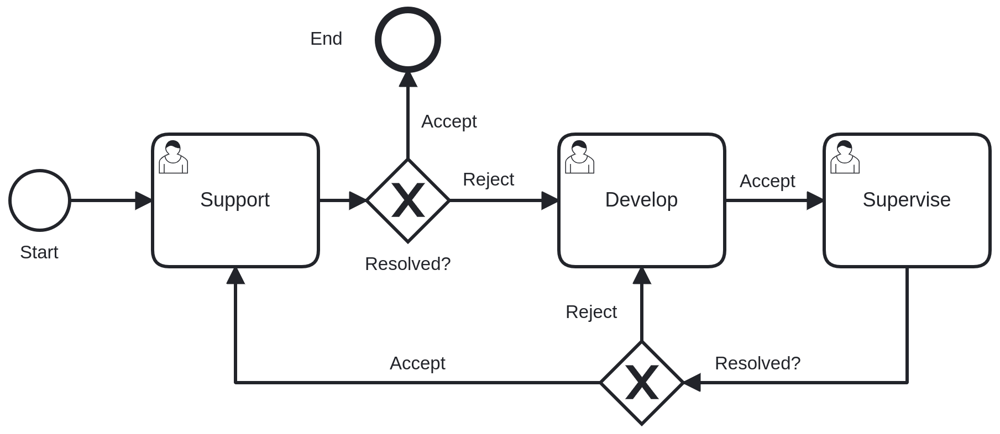

## 🎫 Dew Problem Handling System
A demonstration project that showcases: 
- A problem handling system for company products.
- Workflow design built from scratch and modeled using BPMN 2.0
- A structured backend/frontend built with Serenity (TypeScript + .NET Core)
 
🧩 Features 
- Ticket creation & tracking
- Workflow state transitions
- Product-based ticket categorization
- Admin management panel
- BPMN-compatible workflow modeling
- Dockerized deployment

## 📚 Workflow Overview
The following diagram represents the ticket lifecycle and workflow process:
<p>  </p>

## Running the Project

```bash
$ dotnet restore
$ dotnet build
$ dotnet run

# Docker
$ docker-compose up --build
```

# Tech Stack
- Backend: ASP.NET Core
- Frontend: TypeScript
- Framework: Serenity
- Database: (PostgreSQL / SQL Server)
- Containerization: Docker & Docker Compose

## Known Limitations
This application is a demonstration prototype. For enterprise-level deployment, the following enhancements are recommended:
- Client-level service definitions instead of admin CRUD-level definitions.
- Push notifications for mobile users and a real-time mechanism (e.g., WebSockets) for online users.
- Security hardening.
- Enterprise-level theming.
- Comprehensive reporting modules.
- Role-based customised dashboards.
- Separation of user roles from system roles.

## 📄 License

MIT — see [`LICENSE`](LICENSE).